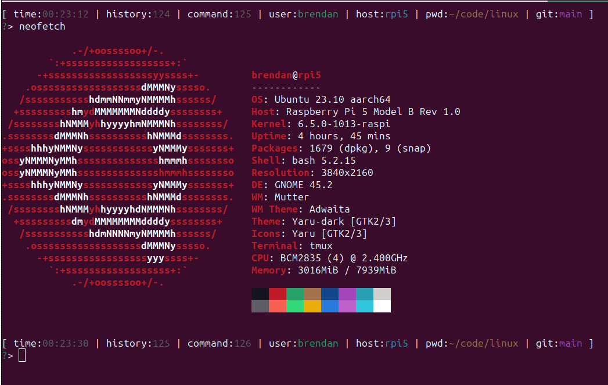

# linux

This repository came about by setting up a
[raspberry pi 5](https://www.raspberrypi.com/products/raspberry-pi-5/)
running
[Ubuntu 23.10](https://ubuntu.com/download/desktop)
for use as a local development environment.

Imagine getting your hands on a new linux computer. What are you going to use
it for? Probably developing software. This repository is meant to quickly
bootstrap a development environment. Especially since my cheap SD cards tend
to die.

## Install

Clone the repository somewhere, I put things in `~/code` organized by
VCS and slug.

```bash
mkdir --parents "${HOME}/code/github.com/mcgarebear"
git clone git@github.com/mcgarebear/linux.git "${HOME}/code/github.com/mcgarebear/linux"
```

Add the `/bin` directory of the repository to your `$PATH` to use the
executable scripts.  For a fresh install, you will likely want to run these
scripts.

```bash
export PATH="${HOME}/code/github.com/mcgarebear/linux/bin:${PATH}"

install-dotfiles
install-dev-packages

update-dev-packages
update-sys-packages
```

To make the prompt environment changes permenent, add them to your
`${HOME}/.bashrc`.

```bash
cat <<EOF >> "${HOME}/.bashrc"

# --------------------------------------
# mcgarebear/linux.git
# --------------------------------------
export PATH="${HOME}/code/github.com/mcgarebear/linux/bin:${PATH}"
[[ -f "${HOME}/.env" ]] && source "${HOME}/.env"
# --------------------------------------

EOF
```

Should look something like this when done.


